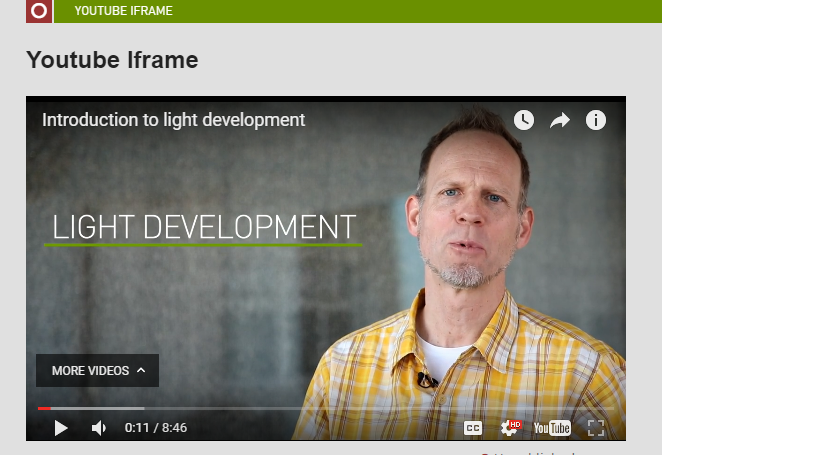
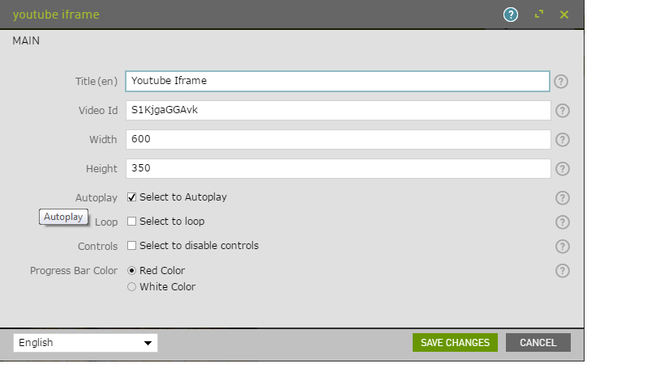

# Youtube Iframe - Component for Magnolia CMS

Iframe for Youtube with different configurations.

## Features

<!--
Provide a list of the key features this module provides for content
authors, or whoever the primary user is. For a component template,
consider providing screenshots of the rendered component and the
component dialog.
-->
![Youtube video id] (_dev/READMEMD-youtube-iframeid.png)

## Usage

Make the component available to authors, and include the files in `webresources` on your pages using standard magnolia techniques.

(To make this component available on the mtk basic page, you could use the decoration included in `_dev/decorations`.)

## Demo

To see a page demonstrating this component, open the Pages app in Magnolia AdminCentral and import the files in `_dev/demos`.)

## Information on Magnolia CMS

This directory is a Magnolia 'light module'.
https://docs.magnolia-cms.com

Search the docs for `sharing light modules` for details on how to share and use light modules on npm and github.

## License
MIT

## Contributors
Prabhat Jain
CMS Developer